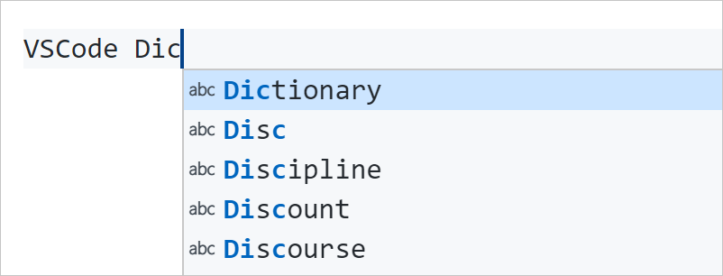
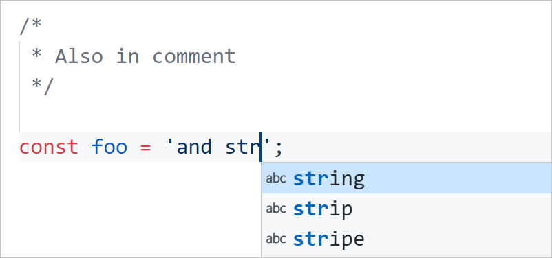

# VSCode Dictionary Completion

[](https://marketplace.visualstudio.com/items?itemName=yzhang.dictionary-completion)
[](https://marketplace.visualstudio.com/items?itemName=yzhang.dictionary-completion)
[](https://github.com/yzhang-gh/vscode-dic-completion/actions)

> Dictionary completion allows user to get a list of keywords, based off of the current word at the cursor.
>
> This is useful if you are typing a long word (e.g. acknowledgeable) and don't want to finish typing or don't remember the spelling
>
> — adapted from [vim wikia](http://vim.wikia.com/wiki/Dictionary_completions)

#### Markdown/LaTeX/HTML



#### Python/JS/TS



- **NOTE**: As of VSCode v1.10.0, quick suggestions for **Markdown** is disabled by default. To enable it, put
  ```js
  "[markdown]": {
      "editor.quickSuggestions": true
  }
  ```
  into your `settings.json`.

- To enable **completion for programming languages** (e.g. Python/JS/TS), be sure to use this setting
  ```js
  "editor.quickSuggestions": {
      "other": true,
      "comments": true, // !!!
      "strings": true   // !!!
  }
  ```
  You can also use language specific ones like `[markdown]` above.

- **[Code Spell](https://marketplace.visualstudio.com/items?itemName=streetsidesoftware.code-spell-checker) compatible**. Words in `cSpell.userWords` and `cSpell.words` are included in the suggestion.

- [Hunspell format](http://manpages.ubuntu.com/manpages/cosmic/man5/hunspell.5.html) compatible.

## Commands

`Completion: Open User Dictionary`

## Settings

| Name                                     | Default | Description                                                                                   |
| ---------------------------------------- | ------- | --------------------------------------------------------------------------------------------- |
| `dictCompletion.leastNumOfChars`         | `0`     | Only show completion list until typing N characters                                           |
| `dictCompletion.useExternalUserDictFile` | `true`  | When set to `false`, load custom words from `userDictionary` in the VSCode user settings      |
| `dictCompletion.externalUserDictFiles`   | `[]`    | A list of paths to dictionary files                                                           |
| `dictCompletion.userDictionary`          | `[]`    | User wordlist (should be an array of string) if `useExternalUserDictFile` is `false`          |
| `dictCompletion.programmingLanguage`     | `true`  | Whether to enable dictionary completion in string and comment of common programming languages |

## Changelog

See [here](CHANGELOG.md).

## Credit

Icons made by [Freepik](http://www.freepik.com) from [www.flaticon.com](http://www.flaticon.com) is licensed by [CC 3.0 BY](http://creativecommons.org/licenses/by/3.0/)

## Other Resources

- [SCOWL (Spell Checker Oriented Word Lists)](http://wordlist.aspell.net/)
- [English Dictionaries Project (AOO+Mozilla+others)](https://github.com/marcoagpinto/aoo-mozilla-en-dict)
- [google-10000-english](https://github.com/first20hours/google-10000-english)
